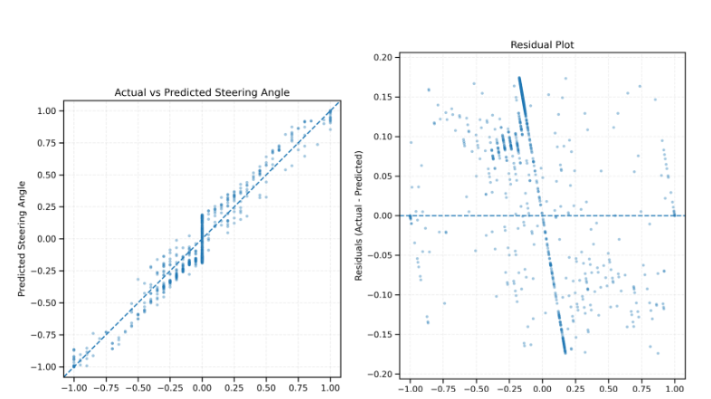

# SHAP-Weighted Triplet Multimodal ViT for Steering Angle Prediction

> **Status:** Paper under review · Full code release after paper acceptance

This repository presents a project page for a **SHAP-weighted triplet multimodal Vision Transformer (ViT)** framework for continuous steering angle prediction. The framework integrates synchronized **left, center, and right camera views** with selected vehicle-state metadata, where metadata features are selected and weighted using **SHapley Additive exPlanations (SHAP)** before multimodal fusion.

## Code Availability Notice

The complete source code, training scripts, evaluation notebooks, configuration files, and trained model checkpoints will be released after acceptance of the associated manuscript. The manuscript is currently under review; therefore, this repository presently provides the methodological summary, representative results, and project documentation.

## Overview

Steering angle prediction is a core behavioral-cloning task in autonomous driving, where a model learns the mapping from driving-scene perception and vehicle-state information to a continuous steering command. This work proposes an explainable multimodal learning framework that combines:

- triplet camera inputs from synchronized left, center, and right views;
- a shared ViT-Small Patch16-224 visual encoder;
- standardized vehicle metadata;
- SHAP-guided metadata selection and weighting;
- multimodal feature concatenation; and
- regression-based steering angle prediction.

The proposed model achieved the best performance among the evaluated configurations, with a test **MAE of 0.1044**, **RMSE of 0.1921**, and **R² score of 0.6573**.

## Proposed Architecture

The model processes synchronized triplet camera views using a shared ViT backbone. SHAP-selected metadata features are weighted before being projected into the same embedding space as the visual features. The projected left, center, right, and metadata embeddings are concatenated and passed through a regression head to predict the normalized steering angle.


## Main Contributions

1. **Triplet multimodal ViT architecture:** A steering angle prediction framework that integrates synchronized left, center, and right camera views with vehicle-state metadata.
2. **SHAP-guided metadata fusion:** A metadata selection and weighting strategy that retains informative features and reduces the influence of weak or irrelevant metadata.
3. **Explainable prediction analysis:** Global metadata importance, aggregated modality contribution, and local attribution heatmaps are used to interpret model behavior.
4. **Ablation-based validation:** The proposed SHAP-weighted fusion strategy is compared against metadata-only, triplet-camera-only, and normal metadata-fusion variants.

## Dataset and Input Representation

The model was evaluated using the **Udacity Self Driving Car – Behavioural Cloning** dataset. After removing invalid and unusable records, **7,334 samples** were retained.

Each sample consists of:

```text
(left image, center image, right image, selected metadata) → center steering angle
```

The original metadata variables considered were:

- throttle
- reverse
- speed

## Results

### Overall Performance

| Metric | Train | Test |
|---|---:|---:|
| MAE | 0.0842 | **0.1044** |
| RMSE | 0.1504 | **0.1921** |
| R² | 0.8748 | **0.6573** |


### Actual versus Predicted Steering Angle

The predicted steering angles show a positive correspondence with the ground-truth steering angles. The residual distribution is centered near zero, indicating stable prediction behavior without a strong systematic overestimation or underestimation trend.



### Ablation Study

| Model configuration | MAE | RMSE | R² |
|---|---:|---:|---:|
| Metadata only | 0.1623 | 0.3300 | 0.0060 |
| Triplet camera only | 0.1391 | 0.2413 | 0.4593 |
| Triplet camera with normal metadata concatenation | 0.1077 | 0.2023 | 0.6126 |
| Triplet camera with SHAP-weighted metadata concatenation | **0.1044** | **0.1921** | **0.6573** |

## Explainability Analysis

### SHAP-Based Metadata Importance

The SHAP analysis indicates that **speed_z** has the strongest metadata-level influence on steering prediction, followed by **throttle_z**. The **reverse_z** feature shows negligible contribution and is excluded from the final metadata branch.

| Metadata feature | Mean absolute SHAP value | Normalized SHAP weight |
|---|---:|---:|
| speed_z | 0.002758 | 0.999996 |
| throttle_z | 0.001041 | 0.377585 |
| reverse_z | 0.000000 | — |

### Local Attribution Visualization

The local attribution heatmaps highlight image regions that influence an individual steering prediction. The highlighted regions are mainly associated with road curvature, lane markings, road boundaries, and relevant driving-scene context.


## Citation

A formal citation will be added after publication.

## License

The license will be finalized when the complete codebase is released after paper acceptance. Until then, the repository contents are provided for academic preview and documentation purposes only.
