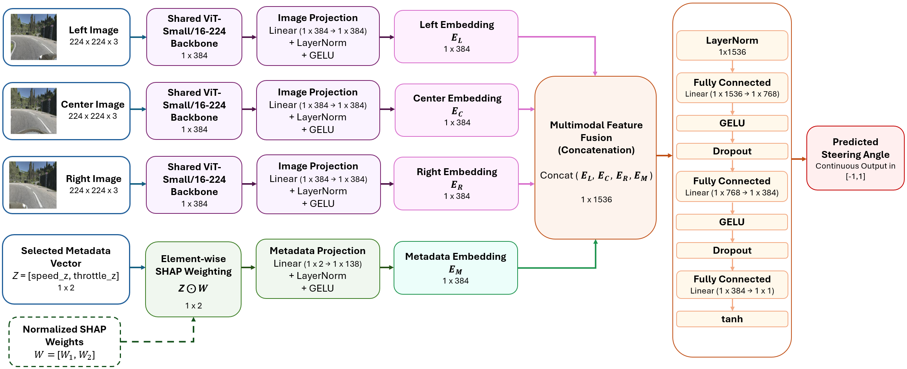
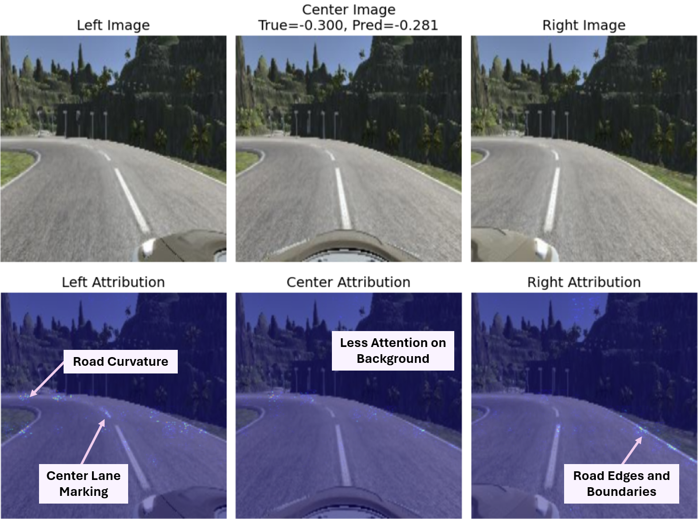

# SHAP-Weighted Triplet Multimodal ViT for Steering Angle Prediction

This repository presents a project page for a **SHAP-weighted triplet multimodal Vision Transformer (ViT)** framework for continuous steering angle prediction. The framework integrates synchronized **left, center, and right camera views** with selected vehicle-state metadata, where metadata features are selected and weighted using **SHapley Additive exPlanations (SHAP)** before multimodal fusion.

## Overview

Steering angle prediction is a core behavioral-cloning task in autonomous driving, where a model learns the mapping from driving-scene perception and vehicle-state information to a continuous steering command. This work proposes an explainable multimodal learning framework that combines:

- triplet camera inputs from synchronized left, center, and right views;
- a shared ViT-Small Patch16-224 visual encoder;
- standardized vehicle metadata;
- SHAP-guided metadata selection and weighting;
- multimodal feature concatenation; and
- regression-based steering angle prediction.

The proposed model achieved the best performance among the evaluated configurations, with a test **MAE of 0.1044**, **RMSE of 0.1921**, and **R² score of 0.6573**.

## Proposed Architecture

The model processes synchronized triplet camera views using a shared ViT backbone. SHAP-selected metadata features are weighted before being projected into the same embedding space as the visual features. The projected left, center, right, and metadata embeddings are concatenated and passed through a regression head to predict the normalized steering angle.



## Main Contributions

1. **Triplet multimodal ViT architecture:** A steering angle prediction framework that integrates synchronized left, center, and right camera views with vehicle-state metadata.
2. **SHAP-guided metadata fusion:** A metadata selection and weighting strategy that retains informative features and reduces the influence of weak or irrelevant metadata.
3. **Explainable prediction analysis:** Global metadata importance, aggregated modality contribution, and local attribution heatmaps are used to interpret model behavior.
4. **Ablation-based validation:** The proposed SHAP-weighted fusion strategy is compared against metadata-only, triplet-camera-only, and normal metadata-fusion variants.

## Project structure

```text
triplet_multimodal_steering_project/
├── configs/
│   └── default.yaml
├── scripts/
│   ├── train.py
│   ├── evaluate.py
│   ├── resume_training.py
│   └── explain.py
├── src/
│   └── triplet_steering/
│       ├── config.py
│       ├── pipeline.py
│       ├── utils.py
│       ├── visualization.py
│       ├── data/
│       ├── models/
│       ├── training/
│       └── xai/
├── requirements.txt
└── pyproject.toml
```

## Installation

Create an environment and install dependencies.

```bash
python -m venv .venv
source .venv/bin/activate
pip install -r requirements.txt
pip install -e .
```

For Windows PowerShell:

```powershell
python -m venv .venv
.venv\Scripts\Activate.ps1
pip install -r requirements.txt
pip install -e .
```

## Configuration

Edit `configs/default.yaml` before running the scripts.

```yaml
data_dir: /path/to/Dataset-self-driving
cleaned_csv: /path/to/Dataset-self-driving/cleaned_driving_log.csv
checkpoints_dir: outputs/checkpoints
```

## Train

```bash
python scripts/train.py --config configs/default.yaml
```

The training script saves checkpoints, metadata-selection artifacts, metrics, prediction CSV files, and paper-ready figures under the configured checkpoint directory.

## Evaluate

```bash
python scripts/evaluate.py --config configs/default.yaml --checkpoint outputs/checkpoints/triplet_vit_selected_meta_concat_center_steering_best.pth
```

## Resume training

```bash
python scripts/resume_training.py --config configs/default.yaml --checkpoint outputs/checkpoints/triplet_vit_selected_meta_concat_center_steering_best.pth --extra-epochs 50 --patience 10
```

## Explainability

```bash
python scripts/explain.py --config configs/default.yaml --checkpoint outputs/checkpoints/triplet_vit_selected_meta_concat_center_steering_best.pth --sample-indices 0 5 10
```

For random samples:

```bash
python scripts/explain.py --config configs/default.yaml --checkpoint outputs/checkpoints/triplet_vit_selected_meta_concat_center_steering_best.pth --random-samples --num-samples 10
```

## Reproducibility notes

Set `seed` in the YAML configuration to reproduce data splits, metadata selection, and training initialization as closely as possible. Exact reproducibility can still vary depending on GPU, CUDA, PyTorch, and hardware-specific kernels.

## Dataset and Input Representation

The model was evaluated using the **Udacity Self Driving Car – Behavioural Cloning** dataset. After removing invalid and unusable records, **7,334 samples** were retained.

Each sample consists of:

```text
(left image, center image, right image, selected metadata) → center steering angle
```

The original metadata variables considered were:

- throttle
- reverse
- speed

## Results

### Overall Performance

| Metric | Train | Test |
|---|---:|---:|
| MAE | 0.0842 | **0.1044** |
| RMSE | 0.1504 | **0.1921** |
| R² | 0.8748 | **0.6573** |

### Ablation Study

| Model configuration | MAE | RMSE | R² |
|---|---:|---:|---:|
| Metadata only | 0.1623 | 0.3300 | 0.0060 |
| Triplet camera only | 0.1391 | 0.2413 | 0.4593 |
| Triplet camera with normal metadata concatenation | 0.1077 | 0.2023 | 0.6126 |
| Triplet camera with SHAP-weighted metadata concatenation | **0.1044** | **0.1921** | **0.6573** |

## Explainability Analysis

### SHAP-Based Metadata Importance

The SHAP analysis indicates that **speed_z** has the strongest metadata-level influence on steering prediction, followed by **throttle_z**. The **reverse_z** feature shows negligible contribution and is excluded from the final metadata branch.

| Metadata feature | Mean absolute SHAP value | Normalized SHAP weight |
|---|---:|---:|
| speed_z | 0.002758 | 0.999996 |
| throttle_z | 0.001041 | 0.377585 |
| reverse_z | 0.000000 | — |

### Local Attribution Visualization

The local attribution heatmaps highlight image regions that influence an individual steering prediction. The highlighted regions are mainly associated with road curvature, lane markings, road boundaries, and relevant driving-scene context.



## Citation

```bibtex
@article{pathirana2026tripletmultimodalvit,
  title   = {A Triplet Multimodal Vision Transformer Framework for Steering Angle Prediction with Metadata-Aware Feature Fusion and Explainability},
  author  = {Pathirana, Nethmi and Munasinghe, Isuru and Dombawala, Charitha and Sanjeewani, Pubudu and Pemasiri, Akila and Perera, Asanka},
  journal = {Journal name to be added after acceptance},
  year    = {2026},
  note    = {To be updated after acceptance}
}
```

The final journal name, volume, issue, page numbers, and DOI will be updated after the article is accepted and published.

## License

The source code in this repository is made publicly available under the MIT License to support reproducibility, academic research, and further development with proper attribution to the original authors.


